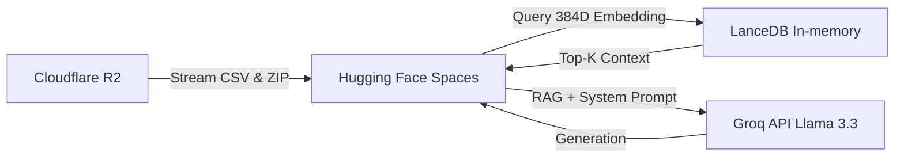

# 🎬 Big Data MLOps Movie Recommender System

[](https://huggingface.co/spaces/thanhtanphan/ai-movie-resys)
[](https://www.python.org/downloads/release/python-3100/)
[](https://streamlit.io)
[](https://lancedb.com/)

A completely **Serverless, Cloud-Native** Movie Recommendation System powered by Large Language Models (LLMs) and Vector Databases. This project demonstrates how to handle Big Data (MovieLens 25M) and build an Enterprise-grade Retrieval-Augmented Generation (RAG) system with a **zero-cost infrastructure** mindset.

> **🌟 Live Demo:** Try the AI Movie Concierge and explore the Analytics Dashboard directly on [Hugging Face Spaces](https://huggingface.co/spaces/thanhtanphan/ai-movie-resys).

---

## 🎯 Project Goals

1. **End-to-End MLOps Pipeline:** Build an automated pipeline from raw 25M row datasets to vector embeddings using Google Colab.
2. **Zero-cost Architecture:** Discard traditional expensive VPS, Docker Compose, and Always-on databases. Leverage Free-tier cloud services: **Cloudflare R2** (Storage), **Hugging Face Spaces** (App Server), and **Groq** (LLM Inference).
3. **High-Performance Vector Search:** Utilize **LanceDB** as an embedded, in-memory database to query high-dimensional data (384D) in sub-milliseconds using Flat Search and Pandas Metadata Filtering.
4. **Conversational AI Agent (RAG):** Integrate **Llama-3.3-70b-versatile** via Groq API. Equip the LLM with *Function Calling* tools to prevent hallucinations and provide explainable AI recommendations.
5. **Pseudo-Tower Personalization:** Achieve deep user personalization by mathematically calculating weighted average user vectors, completely eliminating the need for dedicated Graph Inference Servers.

---

## 🏗️ System Architecture (2026)

The project follows a unidirectional data flow across four core cloud platforms:



### 🗂️ Directory Structure

The project has been heavily refactored to focus strictly on the active Cloud-native components. Legacy monolithic files (BentoML, Docker Compose, MinIO) have been moved to `_archive/`.

```bash
Big-Data-MLOps-System/
├── app.py                      # Main Streamlit UI (Analytics & AI Concierge)
├── requirements.txt            # Strictly pinned dependencies for HF Spaces
├── notebooks/
│   └── colab_pipeline.ipynb    # Data ETL, Text Enhancement & Vector DB building
├── src/
│   └── serving/
│       ├── chatbot.py          # LLM Agent, RAG, Function Calling, Smart Fallback
│       └── semantic_search.py  # LanceDB connection, Reranker, Pseudo-Tower logic
└── _archive/                   # Legacy codes (MinIO, Spark, BentoML) for reference
```

---

## 🚀 How to Run the Project

The system is split into two phases: **Data Preparation (Colab)** and **Serving (Hugging Face / Local)**.

### Phase 1: Data Preparation (Google Colab)

1. Open `notebooks/colab_pipeline.ipynb` in Google Colab Pro.
2. Setup Colab Secrets (Environment Variables) for:
   - `R2_ACCESS_KEY`, `R2_SECRET_KEY`, `R2_ENDPOINT` (Cloudflare R2)
   - `TMDB_API_KEY` (The Movie Database)
   - `MLFLOW_TRACKING_URI`, `DAGSHUB_USERNAME`, `DAGSHUB_TOKEN` (DagsHub for MLOps tracking)
3. **Run All Cells**. The pipeline will:
   - Download MovieLens 25M from R2.
   - Filter movies (<50 ratings) and merge metadata using Pandas.
   - Perform **Text Embedding Enhancement** (injecting `[Quality]` tokens into descriptions).
   - Encode data into 384D vectors using `SentenceTransformer`.
   - Create a LanceDB database with a strict `FixedSizeList` schema.
   - Compress the DB into `lancedb_movies.zip` and upload it back to Cloudflare R2.

### Phase 2: Application Serving (Local or Hugging Face)

To run the Streamlit frontend and the AI Agent locally:

1. **Clone the repository:**
   ```bash
   git clone https://github.com/thanhtan2210/Big-Data-MLOps-System.git
   cd Big-Data-MLOps-System
   ```

2. **Set up the Python Environment (Python 3.10+ highly recommended):**
   ```bash
   python -m venv .venv
   source .venv/bin/activate  # On Windows: .venv\Scripts\activate
   pip install -r requirements.txt
   ```

3. **Configure Environment Variables:**
   Create a `.env` file in the root directory:
   ```env
   # Cloudflare R2 Keys (To download the DB and stream analytics data)
   AWS_ACCESS_KEY_ID="your_r2_access_key"
   AWS_SECRET_ACCESS_KEY="your_r2_secret_key"
   AWS_ENDPOINT_URL="https://your_account_id.r2.cloudflarestorage.com"
   S3_BUCKET_NAME="movie-mlops"

   # Groq API Key (For the Llama 3.3 Agent)
   GROQ_API_KEY="gsk_your_groq_api_key_here"
   ```

4. **Run the App:**
   ```bash
   streamlit run app.py
   ```
   The app will start at `http://localhost:8501`. On its first run, it will automatically download `lancedb_movies.zip` from your R2 bucket and extract it to initialize the Vector Search Engine.

---

## 🧠 Core Technical Highlights

- **Text Embedding Enhancement:** Instead of encoding plain plots, we dynamically inject ratings into the text string (e.g., `[Quality] Rating: 4.8/5.0`). The Attention Mechanism of `all-MiniLM-L6-v2` picks up this numerical sentiment, clustering masterpiece movies far away from terrible ones in the latent space.
- **Pseudo-Tower Personalization:** Users select their favorite movies. The system fetches their vectors and computes a **Weighted Average Vector** to pinpoint the user's hidden preference location, enabling deep personalization without requiring a standalone Neural Network Inference Server.
- **Reranker Layer:** Eliminates overly-niche recommendations by rescoring vectors using a hybrid formula: `60% Similarity + 30% Popularity + 10% Quality`.
- **Smart Fallback:** Groq API limits (RateLimitError) are handled gracefully. If the LLM quota is exhausted, the Python backend intercepts the exception, performs an offline local LanceDB Vector Search, and returns a structured text list to maintain **100% High Availability**.

---

## 📊 Performance & Benchmarks

To ensure the production system remains extremely lightweight and handles high throughput with sub-millisecond latencies, we benchmarked the search and reranking layers:

- **LanceDB Raw Search Latency:** ~4.79ms average (p50: 4.55ms, p95: 6.71ms)
- **Reranking Rescoring Latency:** ~0.02ms average
- **End-to-End Search Pipeline:** ~6.87ms average (p50: 6.28ms, p95: 10.46ms)

*Detailed performance metrics and reports are documented in [benchmark_results.md](file:///d:/Bon%20Bon/SourceCode/git/Big-Data-MLOps-System/docs/benchmark_results.md).*

---
*Developed as a Graduation Project Report focusing on Big Data and MLOps.*