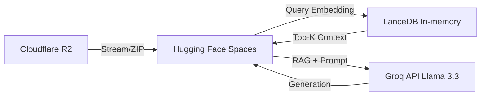

# 01_architecture.md

## Quick Reference
- **Concept**: Serverless, Cloud-native MLOps architecture (2026).
- **Goal**: Zero-cost, high-performance movie recommendation and analytics.
- **Key Stack**: Streamlit, LanceDB, Cloudflare R2, DagsHub/MLflow, Groq API (Llama-3.3-70b).

## System Architecture

## Comparison: Legacy vs. Cloud-Native Stack

| Component | Legacy Stack (Archived) | Current Zero-cost Stack |
| :--- | :--- | :--- |
| **Vector DB** | Milvus (Dedicated Server) | LanceDB (Embedded, In-memory) |
| **Storage** | MinIO (Local) | Cloudflare R2 (Free Egress) |
| **Data Pipeline** | Apache Kafka & Spark Streaming | Google Colab (Pandas/SentenceTransformer) |
| **Tracking** | MLflow Server (Local) | DagsHub MLflow (Managed) |
| **Serving** | BentoML & Docker Compose | Hugging Face Spaces (Serverless CPU) |
| **AI Agent** | Gemini API | Groq API (Llama-3.3-70B with RAG & Tools) |

## Rationale for Selection
We prioritize maximum reliability with zero maintenance cost. **Hugging Face Spaces** scales to zero when idle. **Cloudflare R2** eliminates egress fees for streaming large datasets. **LanceDB** runs in-memory without a separate database server. **Groq API** provides ultra-fast LLM inference to power our Conversational Agent.