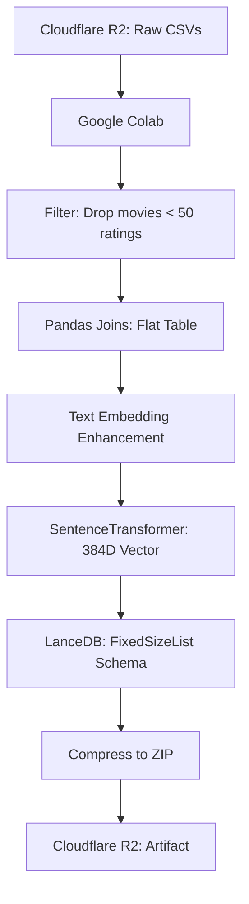

# 02_data_pipeline.md

## Quick Reference
- **Environment**: Google Colab Pro (Ephemeral GPU/RAM).
- **Dataset**: MovieLens 25M (movies, ratings, tags, genome).
- **Output**: Immutable `lancedb_movies.zip` artifact pushed to R2.

## Data Workflow

## Key Engineering Decisions
1. **Quality Gate**: Removing movies with <50 ratings reduces noise and prevents biased embeddings for ultra-niche, undocumented items.
2. **Text Embedding Enhancement**: Instead of just concatenating the title and overview, we inject virtual tokens like `[Quality] Rating: 4.8/5.0, 50000 votes.`. This forces the SentenceTransformer's attention mechanism to cluster high-quality movies together in the latent space.
3. **Strict PyArrow Schema**: Defining the LanceDB vector column explicitly as `pa.list_(pa.float32(), 384)` prevents the Rust backend from inferring variable-length lists, completely avoiding shape mismatch errors (`LanceError: got []`) during KNN searches.